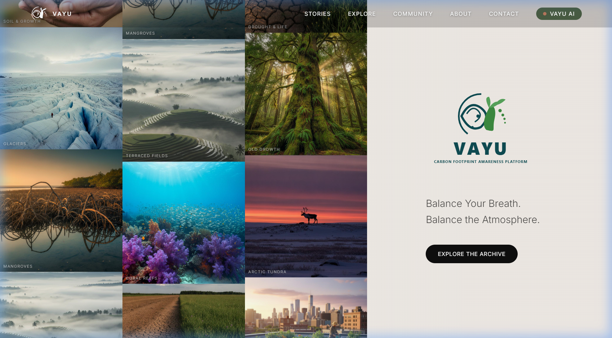
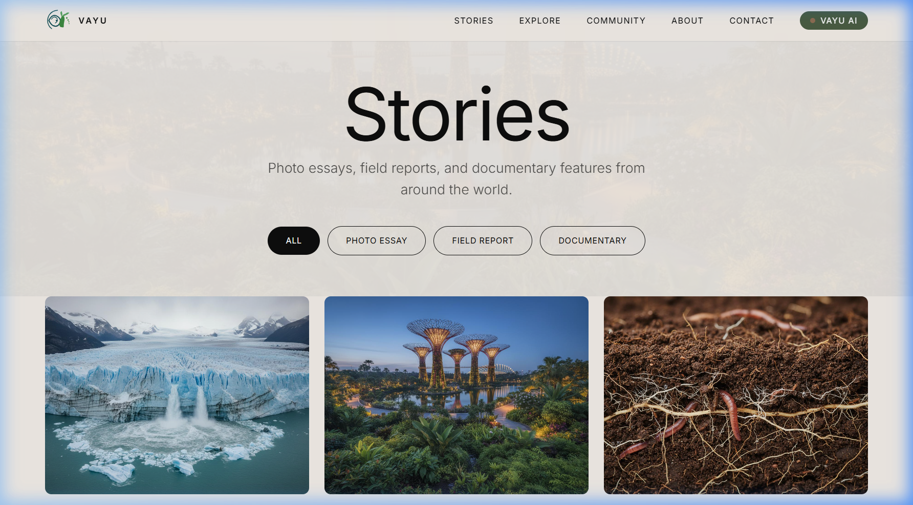
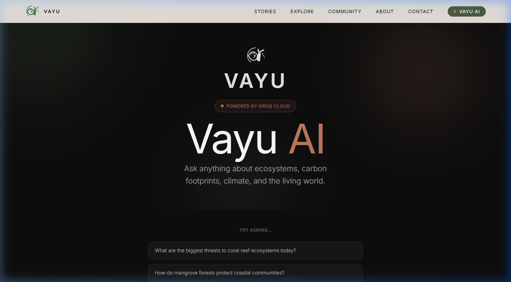
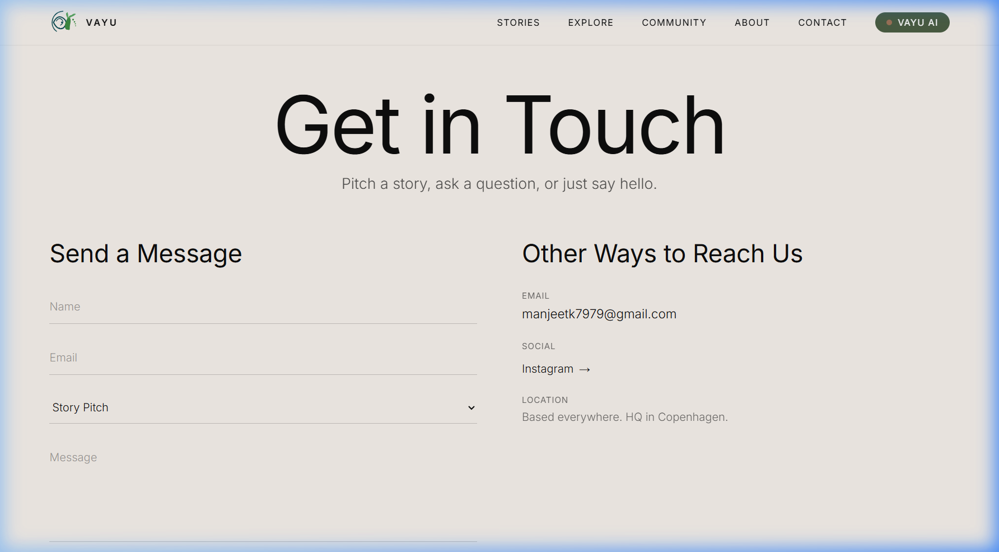

# VAYU — Carbon Footprint Awareness Platform

> *"Balance Your Breath. Balance the Atmosphere."*

VAYU is a state-of-the-art environmental awareness web platform that combines immersive editorial design with intelligent AI to bring the world's carbon footprint and ecosystem crisis into focus. Built for desktop-first experiences with fluid parallax scroll animations, curated nature photography, and a Groq-powered AI assistant.

---

## 📸 Visual Showcase

### 1. Homepage — Parallax Grid Hero
Three vertically scrolling columns of nature imagery with alternating speeds, paired with a frosted glass branding panel. Fully animated on scroll via GSAP ScrollTrigger.



---

### 2. Stories — Editorial Archive
Filterable photo essays, field reports, and documentaries. Cinematic reveal animations triggered on scroll.



---

### 3. Vayu AI — Powered by Groq Cloud (Llama 3.3 70B)
An intelligent environmental assistant with auto-routing between Groq Cloud and a built-in offline knowledge database, so it always responds even when the API is unavailable.



---

### 4. Contact — Gmail + Instagram Integration
Live form submission to Gmail via Web3Forms API. Instagram profile link and mailto fallback included.



---

## 🌟 Core Features

| Feature | Details |
|---|---|
| **Parallax Grid Hero** | 3-column nature image grid, each column scrolling at a different speed, with a frosted glass VAYU branding panel |
| **GSAP Scroll Animations** | Pinned sections, clip-path reveals, band slide-ins, 3D word flips, and parallax backgrounds |
| **Vayu AI** | Groq Cloud (Llama 3.3 70B) with automatic Gemini fallback and a rich offline response database |
| **Ecosystem Stories** | Photo essays, field reports, and documentaries with scroll-triggered image reveals |
| **Contact & Socials** | Web3Forms API → Gmail direct delivery, Instagram profile link |
| **Google Cloud Ready** | Multi-stage Dockerfile, nginx.conf SPA routing, Cloud Build CI/CD pipeline |

---

## 🛠️ Tech Stack

- **Core**: React 19, TypeScript, Vite
- **Styling**: Vanilla CSS + TailwindCSS utility classes
- **Animations**: GSAP + ScrollTrigger, requestAnimationFrame grid loop
- **AI**: Groq Cloud (Llama 3.3 70B) / Google Gemini fallback
- **Forms**: Web3Forms API
- **Deployment**: Google Cloud Run, Docker (multi-stage), Cloud Build

---

## 🚀 Local Setup & Installation

### 1. Clone the repository
```bash
git clone https://github.com/PERO-99/Project-VAYU-.git
cd Project-VAYU-
```

### 2. Install dependencies
```bash
npm install
```

### 3. Configure environment variables
Copy `.env.example` to `.env` and fill in your values:
```bash
cp .env.example .env
```

```ini
# AI — use a Groq key (gsk_...) for best results. Free at console.groq.com
VITE_GEMINI_API_KEY=gsk_your_groq_key_here

# Contact form — sent directly to this Gmail via Web3Forms
VITE_CONTACT_EMAIL=your.email@gmail.com

# Instagram profile URL
VITE_INSTAGRAM_URL=https://instagram.com/your_handle

# Web3Forms access key — free at web3forms.com
VITE_WEB3FORMS_KEY=your_web3forms_key
```

### 4. Start the local server
```bash
npm run dev
```
Visit **[http://localhost:3000](http://localhost:3000)**

---

## ☁️ Google Cloud Run Deployment

The repo is pre-configured with a production-grade multi-stage `Dockerfile`, an `nginx.conf` for SPA routing, and a `cloudbuild.yaml` CI/CD pipeline.

### Option A — One-command deploy via Cloud Build
```bash
gcloud builds submit --config=cloudbuild.yaml \
  --substitutions=\
_VITE_GEMINI_API_KEY="gsk_your_key",\
_VITE_CONTACT_EMAIL="your.email@gmail.com",\
_VITE_INSTAGRAM_URL="https://instagram.com/your_handle",\
_VITE_WEB3FORMS_KEY="your_web3forms_key"
```

### Option B — Manual Docker build & deploy
```bash
# Build image
docker build \
  --build-arg VITE_GEMINI_API_KEY=gsk_your_key \
  --build-arg VITE_CONTACT_EMAIL=your@email.com \
  --build-arg VITE_WEB3FORMS_KEY=your_key \
  -t gcr.io/YOUR_PROJECT_ID/vayu .

# Push and deploy
docker push gcr.io/YOUR_PROJECT_ID/vayu
gcloud run deploy vayu --image gcr.io/YOUR_PROJECT_ID/vayu --platform managed --region us-central1 --allow-unauthenticated
```

> **Security Note**: Your `.env` file is excluded from Git via `.gitignore`. API keys are injected at build time by Google Cloud and never stored in the repository.

---

## 📁 Project Structure

```
Project-VAYU-/
├── src/
│   ├── components/
│   │   ├── LivingGrid.tsx      # 3-column parallax scrolling image grid
│   │   ├── Navigation.tsx      # Sticky nav with scroll-aware styling
│   │   └── Footer.tsx
│   ├── pages/
│   │   ├── Home.tsx            # Hero, briefing, mission, stories, CTA
│   │   ├── Stories.tsx         # Filterable editorial archive
│   │   ├── GeminiChat.tsx      # AI assistant (Groq / Gemini / offline)
│   │   ├── Explore.tsx         # Biome explorer
│   │   ├── Community.tsx       # Community photo showcase
│   │   ├── Contact.tsx         # Web3Forms + Gmail + Instagram
│   │   └── About.tsx
│   └── index.css               # Full design system
├── public/
│   ├── images/                 # All photography assets
│   ├── screenshots/            # README showcase images
│   └── vayu-logo-full.svg
├── Dockerfile                  # Multi-stage production build
├── nginx.conf                  # SPA routing for Cloud Run
├── cloudbuild.yaml             # Cloud Build CI/CD pipeline
└── .env.example                # Template for environment setup
```

---

## 🌿 License

MIT — Built with care for the planet.
